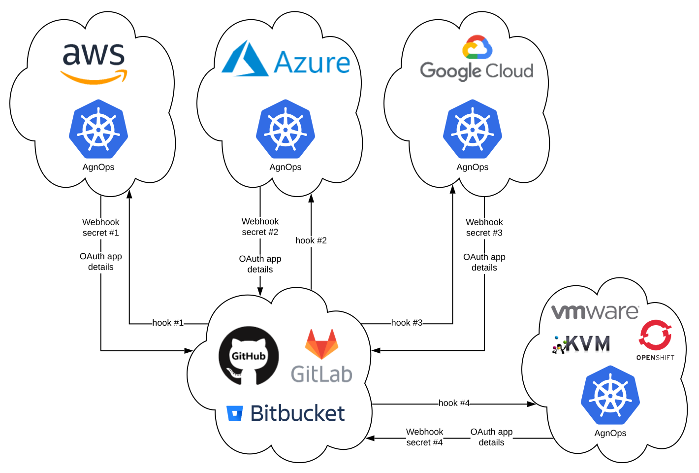

# Multicloud Installation guide



### The main emphasis on installing AgnOps in each cloud:

1. Choose a different subdomain for each cloud and set it at the `global.ingress.tls` section.
2. If you are using each cloud's registry, then enable the **cloud-wrapper** component by setting `cloud-wrapper.enabled=true` in helm command and set the cloud's config file as a secret, as you can [read more here](https://github.com/agnops/cloud-wrapper).

### * As a result, your helm commands should look like this:

#### Shared execution block:
```bash
export scmProvider=github # gitlab , bitbucket
export ingressClass='--set global.ingress.annotations.kubernetes\.io/ingress\.class=nginx'
export slackUrl="https://hooks.slack.com/services/bla/bla/bla"
export oauth2Proxy='--set oauth2-proxy.clientId="",oauth2-proxy.clientSecret="",oauth2-proxy.cookieSecret=""'
export namespace="default" # ci-cd-tools
```

#### AWS:
```bash
kubectl create secret generic aws-account-config --from-file path/to/config  -n $namespace --dry-run -o yaml | kubectl apply -f -

helm upgrade --install aws-github agnops/agnops --set cloud-wrapper.cloudProvider=AWS --set global.ingress.hosts[0]="aws.mydomain.com" $oauth2Proxy --set notification.slack.webhookUrl=$slackUrl --set global.scmProvider=$scmProvider $ingressClass --namespace=$namespace
```

#### Azure:
```bash
kubectl create secret generic azure-account-credentials --from-literal=username='<user>' --from-literal=password='<passwprd>' --from-literal=tenant='<tenant>' -n $namespace --dry-run -o yaml | kubectl apply -f -

helm upgrade --install azure-github agnops/agnops --set cloud-wrapper.cloudProvider=Azure --set global.ingress.hosts[0]="azure.mydomain.com" $oauth2Proxy --set notification.slack.webhookUrl=$slackUrl --set global.scmProvider=$scmProvider $ingressClass --namespace=$namespace
```

#### GCP:
```bash
kubectl create secret generic gcp-config --from-file path/to/.boto  -n $namespace --dry-run -o yaml | kubectl apply -f -

helm upgrade --install gcp-github agnops/agnops --set cloud-wrapper.cloudProvider=GCP --set global.ingress.hosts[0]="gcp.mydomain.com" $oauth2Proxy --set notification.slack.webhookUrl=$slackUrl --set global.scmProvider=$scmProvider $ingressClass --namespace=$namespace
```

#### On-premise:
```bash
helm upgrade --install onprem-github agnops/agnops --set cloud-wrapper.enabled=false --set global.ingress.hosts[0]="onprem.mydomain.com" $oauth2Proxy --set notification.slack.webhookUrl=$slackUrl --set global.scmProvider=$scmProvider $ingressClass --namespace=$namespace
```